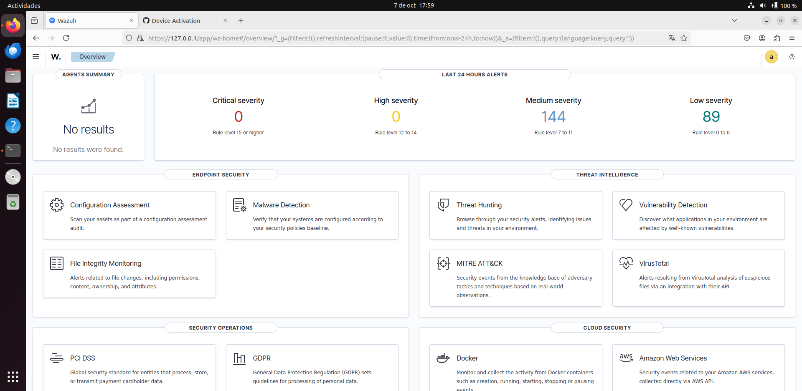

# Wazuh + TPOT SOC Lab

Laboratorio SOC personal para practicar operativa Blue Team: despliegue de un
SIEM (Wazuh) en local y un honeypot multi-servicio (TPOT) en una VPS pública,
conectados por túnel WireGuard. Los ataques reales contra el honeypot se
detectan, enriquecen y visualizan en tiempo real.

> **Estado:** Fase 1 completada — Wazuh todo-en-uno desplegado y operativo.

---

## 1. Problema

Los perfiles junior en ciberseguridad suelen tener dificultades para demostrar
experiencia práctica real. Los cursos y certificaciones no siempre evidencian
capacidad operativa: montar, monitorizar y analizar eventos en un SIEM real.

Este proyecto documenta la construcción de un SOC funcional end-to-end con
evidencia reproducible: instalación, configuración, reglas de detección,
dashboards y análisis de ataques reales capturados por un honeypot expuesto
en Internet.

---

## 2. Objetivo

**Qué hace este proyecto:**

- Despliega Wazuh todo-en-uno (Manager + Indexer + Dashboard) sobre Ubuntu 22.04 LTS.
- Expone un honeypot TPOT en una VPS pública para recibir ataques reales de Internet.
- Conecta ambos entornos mediante túnel WireGuard, sin exponer el SIEM.
- Aplica reglas de detección mapeadas a MITRE ATT&CK.
- Visualiza la actividad maliciosa en dashboards específicos.

**Qué NO hace:**

- No es un SOC de producción.
- No sustituye a un SIEM empresarial.
- No pretende detectar amenazas avanzadas (APTs).

---

## 3. Arquitectura

### Estado actual (Fase 1)

```
┌──────────────────────────────────────────────┐
│  Ubuntu 22.04 LTS (VirtualBox, NAT)          │
│  IP: 10.0.2.15                               │
│                                              │
│  ┌────────────────────────────────────────┐  │
│  │  Wazuh Manager      (1514, 1515, 55000)│  │
│  │  Wazuh Indexer      (9200, solo local) │  │
│  │  Wazuh Dashboard    (443)              │  │
│  └────────────────────────────────────────┘  │
│                                              │
│  8 vCPU · 8 GB RAM · 50 GB disco             │
└──────────────────────────────────────────────┘
```

### Estado objetivo (Fase final)

```
┌──────────────────────────┐         ┌──────────────────────────┐
│  VPS pública             │         │  Ubuntu 22.04 (local)    │
│                          │         │                          │
│  ┌────────────────────┐  │         │  ┌────────────────────┐  │
│  │  TPOT              │  │   WG    │  │  Wazuh Manager     │  │
│  │  - Cowrie          │◄─┼─────────┼─►│  Wazuh Indexer     │  │
│  │  - Dionaea         │  │         │  │  Wazuh Dashboard   │  │
│  │  - Suricata        │  │         │  │  + Agente Wazuh    │  │
│  └────────────────────┘  │         │  └────────────────────┘  │
│  10.10.0.2 (WireGuard)   │         │  10.10.0.1 (WireGuard)   │
└──────────────────────────┘         └──────────────────────────┘
         ▲
         │  Ataques reales de Internet
         │  (bots, escáneres, atacantes)
```

---

## 4. Instalación

Documentación detallada paso a paso en
[`docs/01-installation.md`](docs/01-installation.md).

**Resumen rápido:**

```bash
# 1. Ajuste del kernel (crítico para Wazuh Indexer)
sudo sysctl -w vm.max_map_count=262144
echo "vm.max_map_count=262144" | sudo tee -a /etc/sysctl.conf
sudo sysctl -p

# 2. Descarga del instalador
cd ~
curl -sO https://packages.wazuh.com/4.9/wazuh-install.sh
curl -sO https://packages.wazuh.com/4.9/config.yml
chmod +x wazuh-install.sh

# 3. Ajuste de config.yml (sustituir placeholders)
sed -i 's/<indexer-node-ip>/127.0.0.1/g' config.yml
sed -i 's/<wazuh-manager-ip>/127.0.0.1/g' config.yml
sed -i 's/<dashboard-node-ip>/127.0.0.1/g' config.yml

# 4. Instalación all-in-one
sudo bash wazuh-install.sh -a
```

Duración estimada: 10-20 minutos.

---

## 5. Uso

Acceso al dashboard desde el navegador de la VM:

```
https://127.0.0.1
```

Credenciales generadas por el instalador y almacenadas en
`~/wazuh-install-files.tar`.

Verificación rápida del estado:

```bash
# Servicios activos
sudo systemctl is-active wazuh-indexer wazuh-manager wazuh-dashboard

# Estado del cluster
curl -sk -u admin:TU_PASSWORD https://localhost:9200/_cluster/health?pretty
```

---

## 6. Capturas



*Panel principal del Wazuh Dashboard tras la instalación inicial, mostrando
métricas de las últimas 24 horas.*

---

## 7. Testing

Pendiente de implementar cuando se añadan las reglas de detección.

Los tests previstos validarán que las reglas personalizadas disparan con
eventos de ejemplo (logs sintéticos de Cowrie, Dionaea y Suricata).

---

## 8. Seguridad

### Gestión de secretos

Este repositorio **no contiene credenciales reales**. Patrón seguido:

- `.env.example` → plantilla pública con valores `CHANGE_ME`
- `.env` → fichero local con valores reales, ignorado por git

El `.gitignore` bloquea explícitamente:

- Ficheros `.env` y variantes
- Claves y certificados (`*.pem`, `*.key`, `*.crt`)
- Claves WireGuard (`privatekey`, `publickey`)
- Credenciales del instalador (`wazuh-passwords.txt`, `wazuh-install-files.tar`)

### Superficie de exposición

- El dashboard **no se expone directamente a Internet**.
- El acceso se realiza desde la red local o por túnel WireGuard.
- La VPS solo expone los puertos de los honeypots (deliberadamente vulnerable).

### Aviso legal

Este proyecto se usa exclusivamente contra infraestructura propia.
Nunca ataques sistemas de terceros sin autorización por escrito.

---

## 9. Roadmap

### Fase 1 — Wazuh base
- [x] Desplegar Wazuh todo-en-uno en Ubuntu 22.04
- [x] Verificar cluster `green` y acceso al dashboard
- [ ] Conectar agente Wazuh local para validar pipeline

### Fase 2 — Honeypot en VPS
- [ ] Contratar VPS y desplegar TPOT
- [ ] Configurar túnel WireGuard VPS ↔ local
- [ ] Conectar agente Wazuh de la VPS
- [ ] Verificar llegada de eventos reales al SIEM

### Fase 3 — Detección
- [ ] Añadir reglas de detección para Cowrie
- [ ] Añadir reglas de detección para Dionaea
- [ ] Añadir reglas de detección para Suricata
- [ ] Documentar cada regla con mapeo MITRE ATT&CK
- [ ] Añadir tests de reglas con eventos de ejemplo

### Fase 4 — Visualización y respuesta
- [ ] Exportar dashboards personalizados como código (ndjson)
- [ ] Añadir Active Response para bloqueo de IPs
- [ ] Integrar enriquecimiento (VirusTotal, AbuseIPDB, OTX)

---

## 10. Documentación adicional

- [Instalación detallada](docs/01-installation.md)
- [Arquitectura](docs/02-architecture.md)
- [Decisiones de diseño (ADR)](docs/adr/)

---

## Licencia

MIT — ver [LICENSE](LICENSE).
